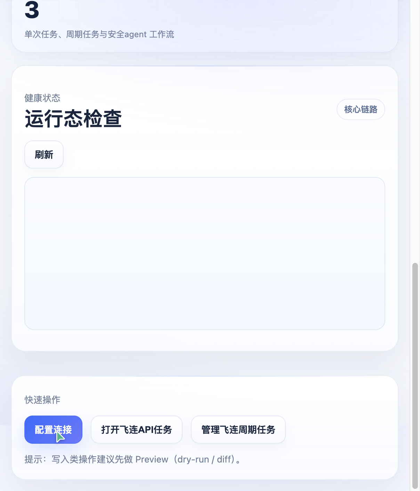
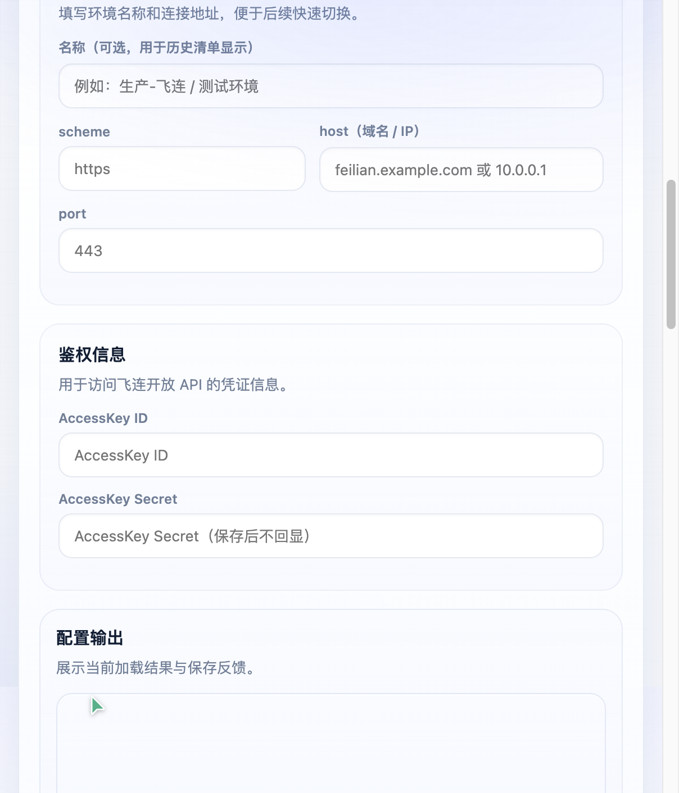
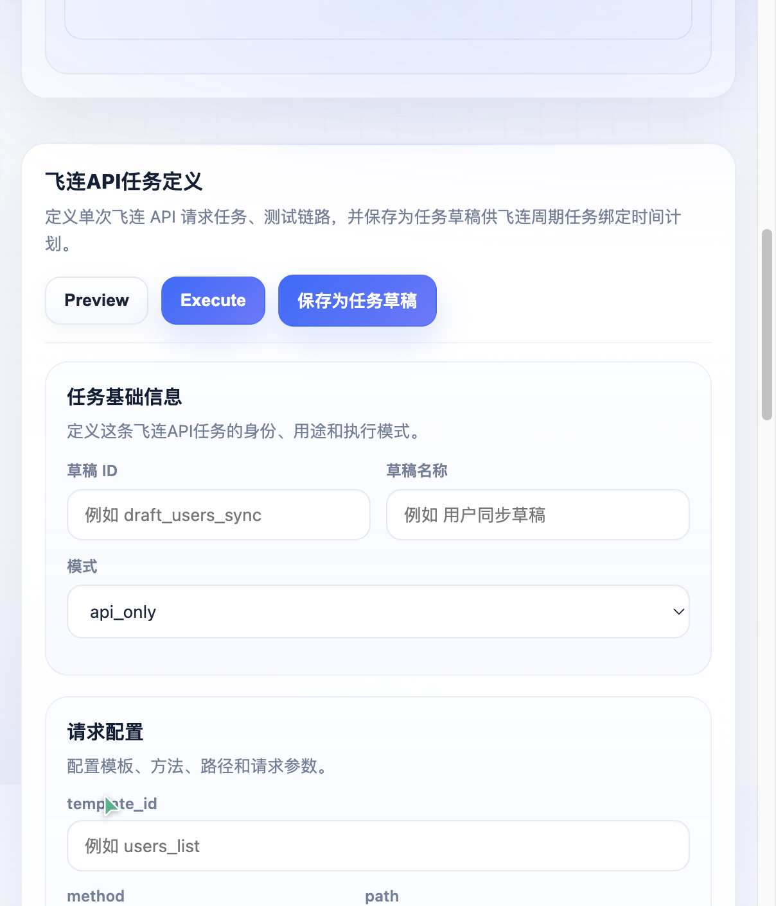
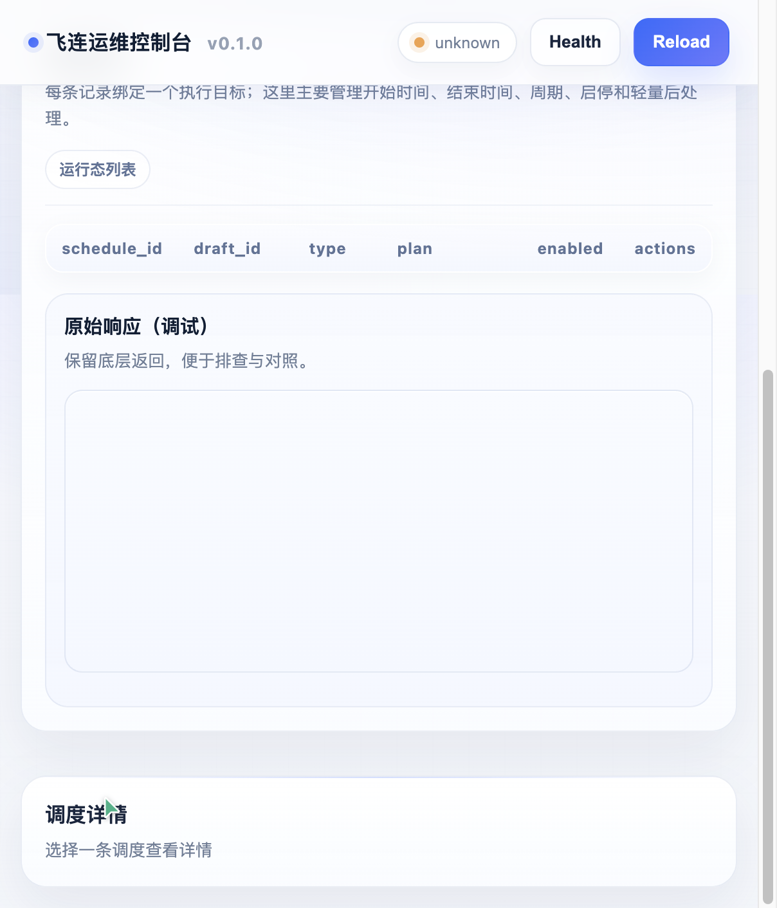
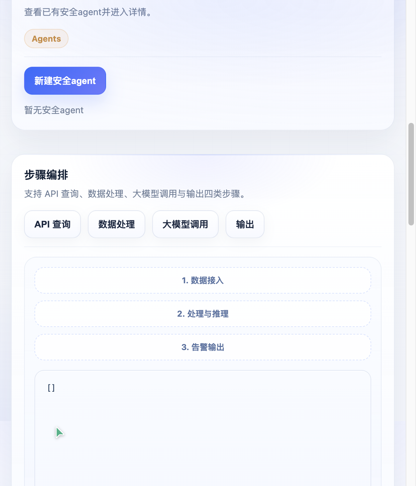
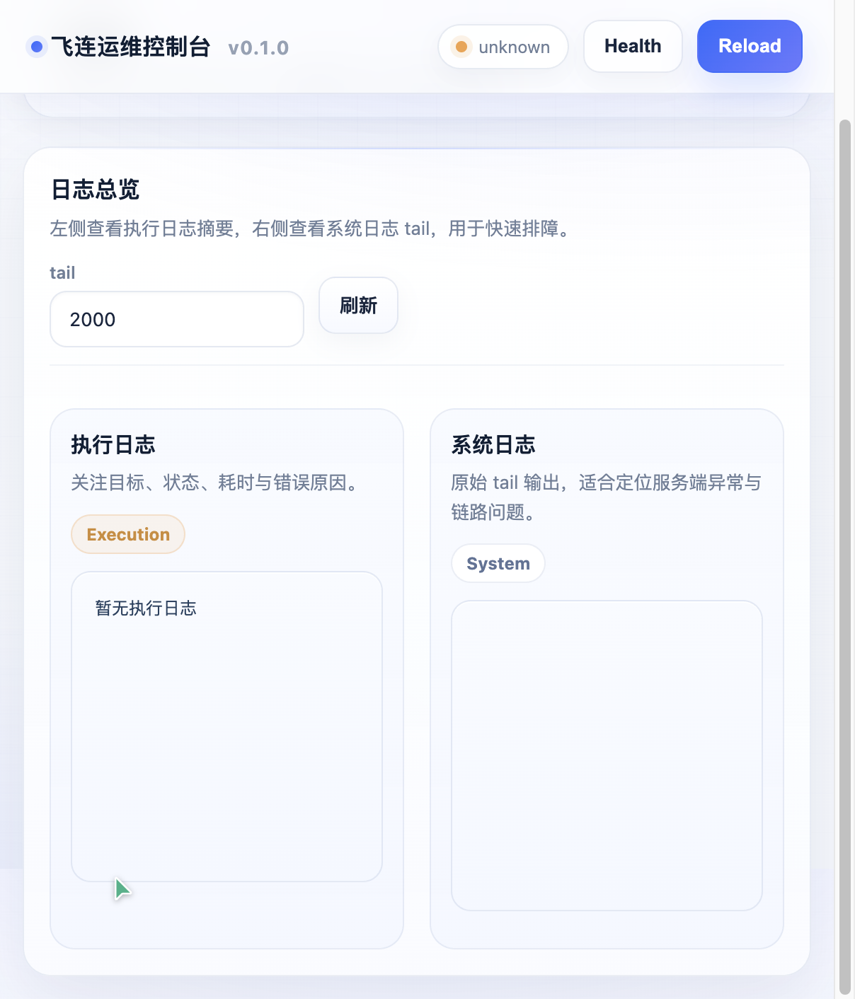

# 飞连运维控制台新版 UI 设计说明

版本基线：当前代码库界面实现状态  
文档用途：说明本轮 UI 改版的设计目标、视觉语言、信息架构、页面结构和截图示例  
配套截图目录：`ui-screenshots/`

---

## 1. 文档目的

本说明文档用于沉淀飞连运维控制台新版 UI 的设计思路与交付结果，方便：

- 产品、研发、测试统一理解新版界面的结构与视觉方向
- 后续继续迭代时保持命名、组件和层级的一致性
- 管理员和使用者快速对照截图理解当前界面布局

本轮 UI 改版并非单纯换色，而是一次“信息架构 + 视觉语言 + 运维可读性”的综合升级。

---

## 2. 设计目标

本轮改版的核心目标有 4 个：

### 2.1 从深色赛博风切换到正式后台产品风

旧版界面更偏深色监控面板风格，具有一定视觉冲击，但不利于长时间阅读、配置和排障。  
新版改为：

- 浅色企业后台风
- 低饱和蓝紫点缀
- 大留白
- 弱阴影与细边框卡片

这样更接近企业内部控制台、运维平台和安全运营后台。

### 2.2 让“首页”和“智能体页”保留产品感

虽然整体改成了浅色后台风，但 `Dashboard` 和 `运营agent` 不希望变成纯表单页。  
因此这两页保留了轻看板式设计：

- Hero Banner
- 指标卡
- 标签化信息摘要

使其既正式，又具备产品首页和智能体工作台的辨识度。

### 2.3 强化配置、调度、日志的可读性

控制台的主要价值不是“好看”，而是：

- 连接配置清晰
- 单任务和周期任务易于维护
- 运营agent 编排易于理解
- Logs 和运行结果更利于排障

所以本轮重点加强了：

- 分组表单
- 统一的结果面板
- 更清晰的状态标签
- 更醒目的成功/错误提示块

### 2.4 统一新版命名体系

旧版的部分页面名称已经不符合当前产品定位，因此本轮配合 UI 统一完成了命名更新：

- `API 工具箱` -> `飞连API任务`
- `Jobs` -> `飞连周期任务`
- `复杂任务` -> `运营agent`

---

## 3. 视觉方向

## 3.1 整体风格

新版界面采用“企业后台风 + 轻数据看板风”的折中路线。

适用分工如下：

- `连接设置 / 飞连API任务 / 飞连周期任务 / Logs`
  - 偏企业后台风
  - 强调表单、列表、配置、排障

- `Dashboard / 运营agent`
  - 偏轻看板风
  - 强调概览、能力展示和工作台感

## 3.2 配色策略

主色系设计如下：

- 主背景：浅灰白
- 卡片背景：白色和极浅冷白
- 主强调色：蓝色
- 辅助强调色：浅紫蓝
- 成功色：低饱和绿色
- 错误色：低饱和红色
- 警告色：低饱和橙色

这套配色更适合：

- 长时间阅读
- 列表扫描
- 配置输入
- 日志排障

## 3.3 组件语言

新版界面的核心组件语言包括：

- `page-title`
  - 作为页面头图区
  - 用于承载标题、副说明、标签和辅助说明

- `hero-stats / stat-card`
  - 用于首页和智能体页的指标卡

- `panel-head / panel-title / panel-actions`
  - 用于统一各类业务面板的标题区与操作区

- `form-section / section-title`
  - 用于分组式表单

- `result-shell / result-head`
  - 用于统一输出面板、调试面板、结果区

- `pill`
  - 用于状态标签和轻量信息标记

- `alert-block`
  - 用于错误、成功、提示类结果

---

## 4. 信息架构调整

新版控制台左侧导航按以下顺序组织：

1. `Dashboard`
2. `连接设置`
3. `飞连API任务`
4. `飞连周期任务`
5. `运营agent`
6. `Logs`

这一顺序符合从“基础设施配置”到“单任务”再到“周期任务”与“智能体工作流”的认知路径。

其中你特别要求的顺序调整也已纳入：

- `飞连API任务`
- `飞连周期任务`

已按要求把 `飞连API任务` 放在 `飞连周期任务` 前面。

---

## 5. 页面级设计说明

## 5.1 Dashboard

### 设计意图

`Dashboard` 作为首页，不应只是按钮集合。  
它现在承担三个角色：

- 系统入口
- 状态总览
- 结构导航

### 设计变化

- 增加 Hero Banner
- 增加顶部功能标签
- 增加 4 张指标卡
- 健康状态被提到首屏核心位置
- 保留“配置连接 / 打开飞连API任务 / 管理飞连周期任务”等快捷入口

### 截图

---

## 5.2 连接设置

### 设计意图

`连接设置` 是配置中心，不只是一个表单页。  
因此新版把它分成两层：

- 顶部轻量概览卡
- 下方双列配置工作区

### 设计变化

- 增加 3 张 compact 指标卡：
  - 环境配置
  - 模型角色
  - 运行方式
- 飞连连接配置与 LLM 配置分别拥有统一的 `panel-head`
- 飞连连接配置内部拆成：
  - 基础信息
  - 鉴权信息
- LLM 双角色配置区也统一进入结果壳层
- 配置输出改为独立结果面板，而不是裸 `pre`

### 截图

---

## 5.3 飞连API任务

### 设计意图

`飞连API任务` 是单任务定义工作台。  
UI 设计上要同时支持：

- 模板管理
- 请求配置
- 处理与输出配置
- 结果预览

### 设计变化

- 模板区改为统一面板头 + 操作按钮
- 任务定义区拆成三段：
  - 任务基础信息
  - 请求配置
  - 处理与输出
- 顶部操作区整合 `Preview / Execute / 保存为任务草稿`
- 输出区改成统一 `result-shell`
- 模板原始响应也统一进后台结果面板

### 截图

---

## 5.4 飞连周期任务

### 设计意图

`飞连周期任务` 是调度中心，因此要强调：

- 任务筛选
- 调度列表
- 详情排障

### 设计变化

- 顶部增加 `筛选与操作` 卡片
- 搜索、过滤、刷新、新建、Reload 全部进入同一工具条
- 列表改成更规整的浅色后台表格
- 调度详情区增加更像运维详情卡的结构
- 最近一次运行摘要增加状态条和错误块

### 截图

---

## 5.5 运营agent

### 设计意图

`运营agent` 是新版中最有产品辨识度的页面。  
它不应只是“复杂任务表单”，而应更像一个智能体工作台。

### 设计变化

- 顶部增加 Banner 与标签组
- 增加 3 张能力指标卡
- 三栏工作区重新设计：
  - 左栏：运营agent 列表
  - 中栏：步骤编排工作台
  - 右栏：配置、预览、运行结果、输出模板
- 中栏新增 `workflow rail`
  - 数据接入
  - 处理与推理
  - 告警输出
- 步骤列表升级为节点式流程卡片：
  - 步骤编号
  - 步骤类型徽标
  - 节点标签
  - 拖拽态与选中态
- 运行结果增加：
  - 总体状态条
  - 步骤级状态条
  - 成功/错误提示块

### 截图

---

## 5.6 Logs

### 设计意图

`Logs` 页不只是“原始日志 tail”，它应该是排障页。  
所以新版把它做成了运维双栏：

- 左侧执行日志
- 右侧系统日志

### 设计变化

- 顶部增加统一面板头
- `tail` 和刷新按钮放进操作区
- 执行日志增加：
  - 状态卡
  - 状态条
  - 错误/成功块
- 系统日志仍保留原始输出，但进入统一结果壳层

### 截图

---

## 6. 尺寸与可用性优化

本轮不仅美化，还对大量输入区和输出区做了扩容，避免原来“能用但拥挤”的问题。

重点放大的区域包括：

- `exec-body`
- `draft-transform`
- `draft-llm`
- `draft-output`
- `llm-planner-system-prompt`
- `llm-formatter-system-prompt`
- `complex-task-goal`
- `complex-task-steps`
- `complex-task-run-out`
- `logs`
- `execution-logs`
- 抽屉面板宽度

这样带来的直接收益是：

- JSON 编辑更舒服
- 日志排障更直观
- 智能体编排与运行结果更容易阅读

---

## 7. 设计收益总结

新版 UI 的整体收益可概括为：

### 7.1 更像正式产品

从“开发期工具面板”升级为“可交付后台控制台”。

### 7.2 更符合模块职责

每个页面的视觉风格和结构都更贴合其角色：

- 配置页像配置页
- 调度页像调度页
- 智能体页像工作台
- 日志页像排障页

### 7.3 更利于培训与交接

新界面分区明确、命名一致、结果区统一，因此后续更适合：

- 写操作手册
- 做演示
- 做内部培训
- 做功能迭代

---

## 8. 后续建议

如果后续继续演进，建议优先考虑以下方向：

1. 为 `运营agent` 加入更明显的节点关系线与步骤摘要
2. 为 `飞连周期任务` 增加历史运行列表和错误分类视图
3. 为 `Logs` 增加筛选条件和按目标聚合
4. 为 `飞连API任务` 增加模板对比与字段提示

这些都可以在当前新版 UI 基础上继续迭代，而不需要重新推翻视觉体系。
